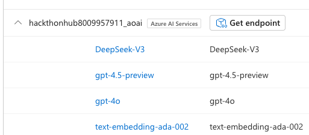
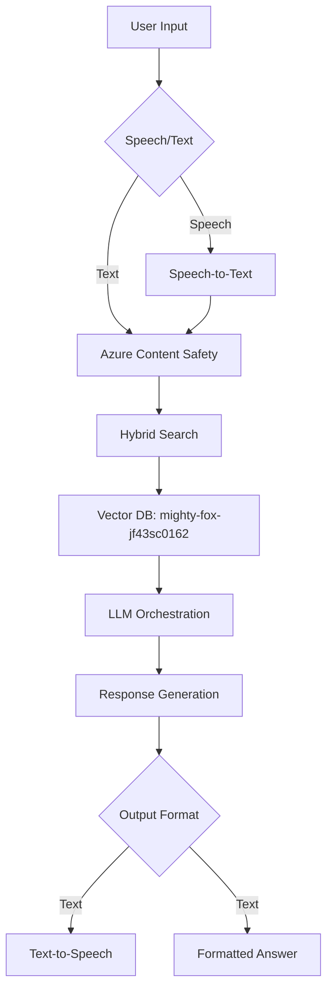

# Canada Student Loan Advisor :canada:  

*A Microsoft Hackathon 2025 Submission*  
**Virtual Assistant for Guiding Students Through Loan Applications with AI-Powered Insights**

---

## Project Overview :rocket:  

**Use Case**: A conversational AI assistant to:  

- Guide students through Canada Student Loan applications.  
- Answer FAQs in natural language.  
- Detect fraud using AI.  
- Process documentation.  
- Provide real-time updates.  
- Support English and French.  

**Key Features**:  

- :mag: **Hybrid Search** (semantic + keyword) for precise answers.  
- :speech_balloon: **Multilingual Support** (English/French).  
- :shield: **Content Safety** to filter harmful queries.  
- :sound: **Speech-to-Text & Text-to-Speech** integration.  
- :gear: **SQL Database Integration** (Work in Progress).  

---

## Core Functionalities :hammer_and_wrench:  

| Feature | Description | Components Used |  
|---------|-------------|-----------------|  
| **Loan Q&A** | Answers student loan questions using RAG pipeline. | `RAG_Pipeline.py`, Vector DB, Hybrid Search |  
| **Error Handling** | Filters harmful/out-of-scope queries. | `Azure_ContentSafety_jailbreak.py` |  
| **Multilingual Support** | Handles English/French interactions. | Azure AI Translator |  
| **Speech Integration** | Converts speech <-> text for accessibility. | Azure AI Speech Service |  
| **SQL Chat (WIP)** | Query loan data via natural language. | `sql-server-connection` |  

---

## Azure Services Used :cloud:  

| Service | Purpose |  
|---------|---------|  
| **Azure AI Foundry** | Central hub for LLM orchestration. |  
| **Azure AI Search** | Hybrid search (semantic + keyword). |  
| **Azure Content Safety** | Filters harmful/inappropriate content. |  
| **Vector Database** | Stores embeddings (DB name: `mighty-fox-jf43sc0162`). |  
| **Model Endpoints** | Deploys LLMs/embedding models. |  

Deployed LLMs :robot:
Deployed LLMs in Azure AI Foundry
Example: A screenshot of the LLM deployment endpoints in Azure AI Foundry.



---

## Ingested Resources :books:  

Data sources for RAG pipeline:  

- [NSLSC FAQ](https://www.csnpe-nslsc.canada.ca/en/frequently-asked-questions)  
- [How to Apply](https://www.csnpe-nslsc.canada.ca/en/how-to-apply)  
- [How to Register (PDF)](https://www.csnpe-nslsc.canada.ca/NSLSCStaticSite/media/Loanstar/additional-resources/How-to-Register-your-NSLSC-Account_Oct2023_EN.pdf)  
- [How to Make a Payment (PDF)](https://www.csnpe-nslsc.canada.ca/NSLSCStaticSite/media/Loanstar/additional-resources/How-to-Make-a-One-Time-Payment-Instructions_E.pdf)  
- [Customize Payment Terms (PDF)](https://www.csnpe-nslsc.canada.ca/NSLSCStaticSite/media/Loanstar/additional-resources/How-to-Customize-My-Payment-Terms_E.pdf)  
- [Pre-Authorized Debit (PDF)](https://www.csnpe-nslsc.canada.ca/NSLSCStaticSite/media/Loanstar/additional-resources/How-to-Activate-PAD-Instructions_E.pdf)  
- [Update Bank Info (PDF)](https://www.csnpe-nslsc.canada.ca/NSLSCStaticSite/media/Loanstar/additional-resources/How[…]ate-Financial-Institution-Information-Instructions_E.pdf)  
- [Certificate of Eligibility (COE)](https://www.canada.ca/content/dam/canada/employment-social-development/migration/do[…]ts/assets/portfolio/docs/en/student_loans/forms/sde0003_en.pdf)  

---

## Technical Architecture :building_construction:  



---

## Setup & Deployment :computer:  

1. **Prerequisites**:  
   - Azure AI Foundry access.  
   - Vector DB connection string (`mighty-fox-jf43sc0162`).  
2. **Install Dependencies**:  

   ```bash  
   pip install -r requirements.txt  
   ```  

3. **Run Core Scripts**:  
   - RAG Pipeline: `python RAG_Pipeline.py`  
   - Content Safety: `python Azure_ContentSafety_jailbreak.py`  

---

## Future Enhancements :sparkles:  

- :hourglass_flowing_sand: **SQL Chat Integration**: Query loan data via natural language.  
- :globe_with_meridians: **Expand Language Support** (e.g., Spanish).  
- :bar_chart: **Analytics Dashboard** for user interaction insights.  

---

**Hackathon Track**: AI for Social Good  

---

*Built with :heart: for Canadian students using Azure AI Foundry.*  
